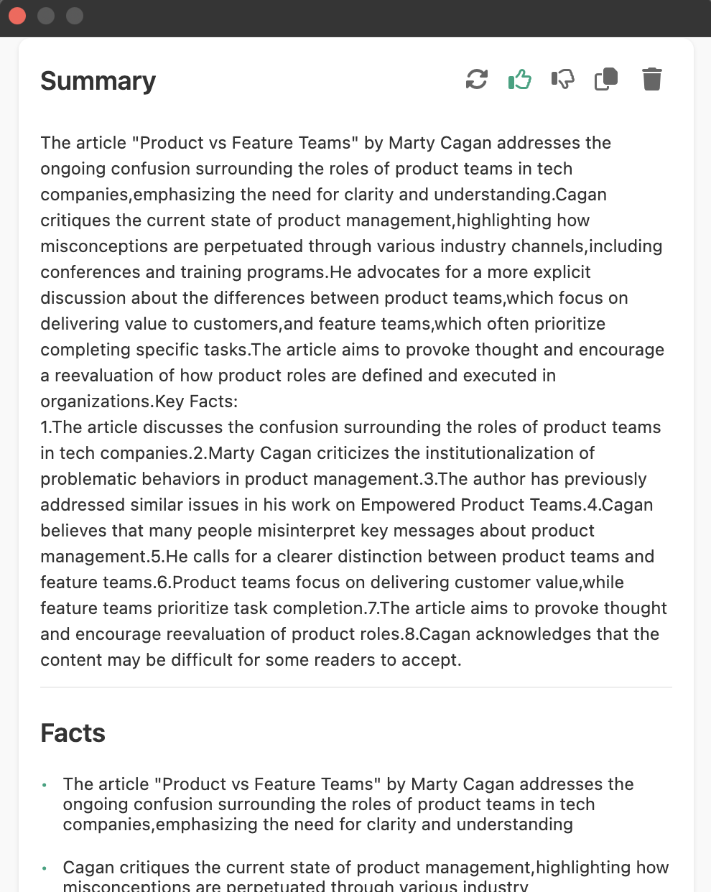

<p align="center">
  
  <h1 align="center">GPT Summary</h1>
</p>

<p align="center">
  A powerful Chrome extension that uses ChatGPT to generate summaries of webpages.
</p>

<p align="center">
  <a href="#features"><strong>Features</strong></a> ·
  <a href="#installation"><strong>Installation</strong></a> ·
  <a href="#usage"><strong>Usage</strong></a> ·
  <a href="#development"><strong>Development</strong></a>
</p>
<br/>

## Features

- **Smart Summarization**

  - Intelligent webpage text extraction
  - ChatGPT-powered summary generation
  - Automatic text truncation for long content
  - Post-processing for enhanced readability

- **Modern UI/UX**

  - Clean and intuitive interface
  - Easy-to-use popup window
  - Loading states and error handling
  - Dark mode support

- **Security & Performance**
  - Secure API key management
  - Efficient text processing
  - Chrome Storage integration
  - Background script optimization

## Installation

1. Clone this repository:

```bash
git clone https://github.com/muradpm/chat-gpt3-summary.git
```

2. Configure the extension:

   - Add your OpenAI API key to extension settings: `OPENAI_API_KEY=your_key_here`

3. Load in Chrome:
   - Open Chrome Extensions page (`chrome://extensions/`)
   - Enable "Developer mode"
   - Click "Load unpacked"
   - Select the cloned repository folder

## Usage

1. Click the extension icon in your Chrome toolbar
2. Navigate to any webpage you want to summarize
3. Click the "Summarize" button
4. View your generated summary with key facts and insights

## Development

### Project Structure

```
├── manifest.json        # Extension configuration
├── popup.html          # Main popup interface
├── styles/
│   └── popup.css       # UI styling
├── scripts/
│   ├── content.js      # Content script
│   ├── popup.js        # Popup logic
│   └── background.js   # Background worker
└── icons/
    └── icon.png        # Extension icon
```

### Dependencies

- [OpenAI API](https://platform.openai.com/docs/introduction) - For GPT-powered summarization

### Running Locally

1. Make required changes to the code
2. Reload the extension in Chrome
3. Test your changes

## License

This project is licensed under the [MIT](https://choosealicense.com/licenses/mit/) License.

## Contact

Created by [@abdulkadyr0v](https://twitter.com/abdulkadyr0v)

- [LinkedIn](https://www.linkedin.com/in/abdulkadyr0v/)
- [Twitter](https://twitter.com/abdulkadyr0v)
